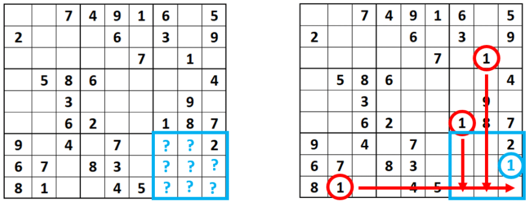

d via# 1. Description.


Sudoku solver is a project encompasses 3 sub-projects:

	1. A sudoku game and a solver.
    2. An android solver (requires adb)
    3. A sudoku generator that reads the screen of an android device.
    
## Prerequisites

- [python 3.9](https://www.python.org/downloads/)
- [pygame 2.0.1](https://www.pygame.org/wiki/GettingStarted)
- [numpy 1.20.3](https://numpy.org/install/)
- [opencv-python 4.5](https://pypi.org/project/opencv-python/)
- [pytesseract 0.3.7](https://pypi.org/project/pytesseract/)
- [pure-python-adb 0.3.0](https://pypi.org/project/pure-python-adb/)
- [Fassor sudoku android app](https://play.google.com/store/apps/details?id=com.fassor.android.sudoku&hl=en&gl=US)


To launch the scripts, execute in a command prompt:

`python3 main_with_multiprocessing`

or

`python3 main_with_multithreading`

this litle GUI will appear: 


  
## 1.1. Sudoku game + solver.

The sudoku game is a classic sudoku game, each time it is launched it starts with different grid chosen in a database of over **1 million** grids.

The solver algorithm is an customized iterative _**Crosshatching algorithm**_ that fills x number of cases at each iteration.
For all the empty cases of a given line, column or sub-grid of the sudoku grid, the algorithm tries each number from 1 to nine and fill the case with a number iff the number is the only possible solution.


## a. commands

`esc` → Clear the grid.

`s` → Launch the solver.

`r` → Load a random grid.
## 1.2. Android solver.
### prerequisite.
- [opencv-python 4.5](https://pypi.org/project/opencv-python/)
- [pytesseract 0.3.7](https://pypi.org/project/pytesseract/)
- [pure-python-adb 0.3.0](https://pypi.org/project/pure-python-adb/)
- [Fassor sudoku android app](https://play.google.com/store/apps/details?id=com.fassor.android.sudoku&hl=en&gl=US)


This module requires the user to have [Fassor sudoku android app](https://play.google.com/store/apps/details?id=com.fassor.android.sudoku&hl=en&gl=US) installed on his android device.

This module also requires the user to  [**install ADB**](https://www.xda-developers.com/install-adb-windows-macos-linux/) on his computer and connect his android to the computer. 

In order to execute adb commands in a python script, the user has to install the pure-python-adb library by executing the following command :

``` pip install -U pure-python-adb```

adb (Android Debbuging Bridge) permits the user (among other things) to take screen shots of the android device and saves it on the computer. This module leverages that possibility to take screen shots of the sudoku app and converts the into an array of integer using [openCV](https://pypi.org/project/opencv-python/) for image porcessing and [pytesseract](https://pypi.org/project/pytesseract/) for character recognition.

The solver will then solve the sudoku but is at solves the sudoku, it will solve it on the android device by sending touch instructions through adb.

### Getting started.
To launch the module, the user must specify whether his device is connected to the computer by [WiFi](https://help.famoco.com/developers/dev-env/adb-over-wifi/) or via USB.
If the device is connected via [WiFi](https://help.famoco.com/developers/dev-env/adb-over-wifi/), the user must specify the ip address of the device, [here](https://help.simpletelly.com/article/329-how-to-find-your-android-device-ip-address) is how to retrieve it.

If all necessary prepartions have been done, the user can push the start button. After aproximatively 30 seconds for the module to process the screenshot, the solver will start solving the sudoku grid on the users android device.
## 1.3. Android sudoku generator.

### prerequisite.
- [opencv-python 4.5](https://pypi.org/project/opencv-python/)
- [pytesseract 0.3.7](https://pypi.org/project/pytesseract/)
- [pure-python-adb 0.3.0](https://pypi.org/project/pure-python-adb/)
- [Fassor sudoku android app](https://play.google.com/store/apps/details?id=com.fassor.android.sudoku&hl=en&gl=US)


### Getting started.
This module uses the same librairies as the previous one, but instead of solving the sudoku grid, this module will copy the current sudoku grid from the android device to the pygame GUI on the computer.

To launch the module, the user must specify whether his device is connected to the computer by [WiFi](https://help.famoco.com/developers/dev-env/adb-over-wifi/) or via USB.
If the device is connected via [WiFi](https://help.famoco.com/developers/dev-env/adb-over-wifi/), the user must specify the ip address of the device, [here](https://help.simpletelly.com/article/329-how-to-find-your-android-device-ip-address) is how to retrieve it.

If all necessary prepartions have been done, the user can push the start button. After aproximatively 30 seconds for the module to process the screenshot, a pygame window will appear with the same grid as the one on the android device.
